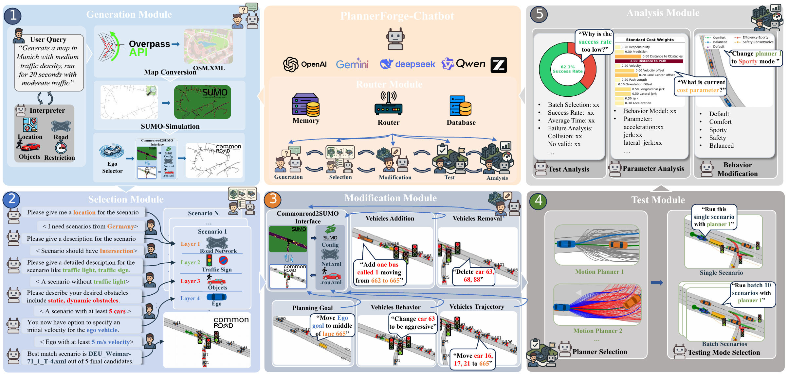
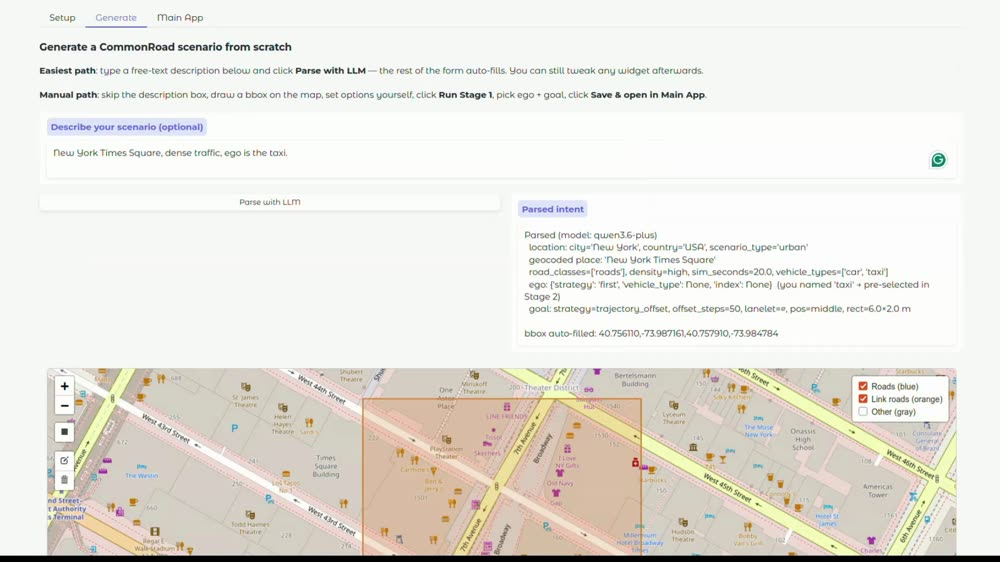
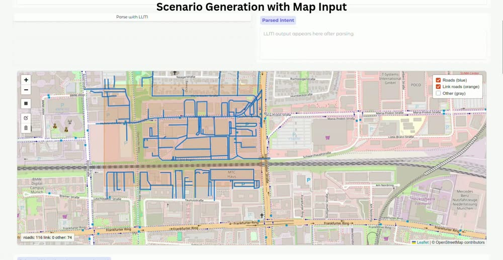
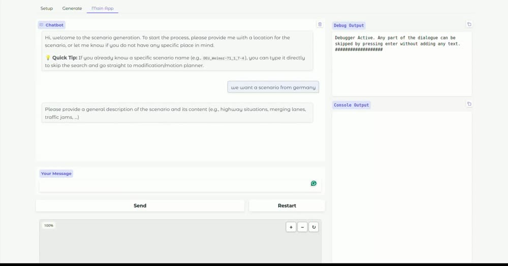
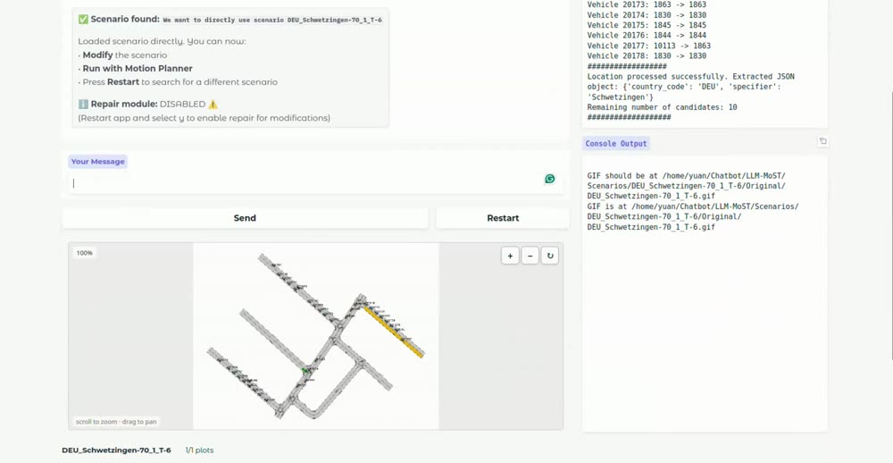
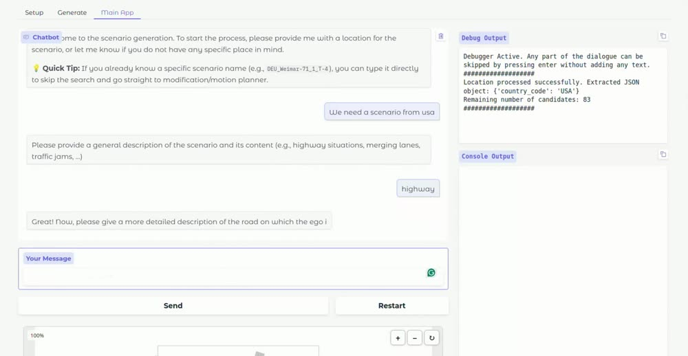
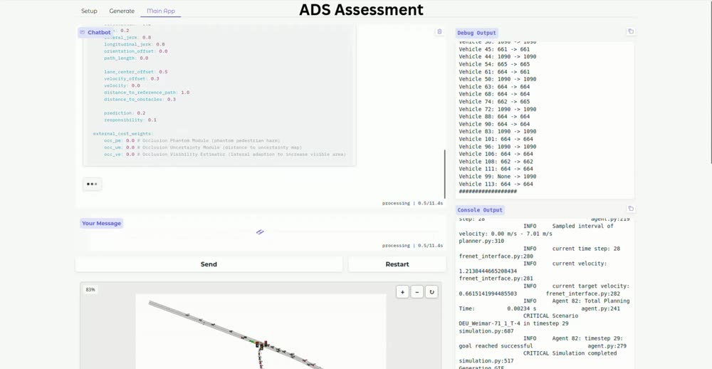
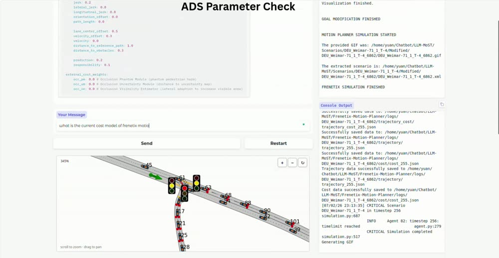

<p align="center">
  
</p>

<h1 align="center">PlannerForge</h1>

<h3 align="center">LLM Agents for Scenario-Based Testing of Motion Planners in Autonomous Driving</h3>

<p align="center">
  Professorship of Autonomous Vehicle Systems, Technical University of Munich &nbsp;&middot;&nbsp; MIRMI
  &nbsp;&middot;&nbsp; University College London
</p>

<p align="center">
  <b>EMNLP 2026</b> &nbsp;|&nbsp;
  📄 <a href="https://arxiv.org/abs/2609.08965">Paper (arXiv:2609.08965)</a> &nbsp;|&nbsp;
  📑 <a href="PlannerForge_EMNLP.pdf">Camera-ready PDF</a> &nbsp;|&nbsp;
  🌐 Project page: <code>index.html</code> (GitHub Pages pending) &nbsp;|&nbsp;
  📝 <a href="https://openreview.net/forum?id=nXasXrTafl">OpenReview</a> &nbsp;|&nbsp;
  🤗 <a href="https://huggingface.co/datasets/TUM-AVS/PlannerForge-Scenarios">Scenario dataset (582 scenarios)</a>
</p>

Welcome to the GitHub repository of PlannerForge. Here you can find the paper, the project
page with demo videos and the full prompt corpus, and — once the release lands — the code.

## Introduction

Scenario-based testing is the systematic process used to validate Autonomous Driving Systems
(ADSs), but in practice it is a **fragmented pipeline**: scenario generation relies on GUI
editors or scripts, selection depends on hand-crafted database filters, ad-hoc modification is
largely unsupported, and cross-planner comparison requires separately scripted batch runs with
offline aggregation.

PlannerForge unifies that pipeline behind **one chatbot-driven interface**. It extends all six
stages of the Riedmaier scenario-based-testing taxonomy and adds two LLM-era stages:

- **Scenario Generation** — a natural-language query or a map input becomes a runnable
  CommonRoad scenario, via Overpass/OpenStreetMap geocoding, road-network construction and
  traffic population.
- **Scenario Database & Selection** — a description (location, road type, obstacles, dynamics)
  retrieves matching scenarios through a five-stage funnel.
- **Scenario Modification** — four edit types routed through SUMO: **T**rajectory redirection,
  **B**ehaviour presets, **P**articipant add/remove, and ego **G**oal.
- **Test Execution** — a unified motion-planner interface over
  [Frenetix](https://github.com/TUM-AVS/Frenetix-Motion-Planner) (sampling-based) and
  MP-RBFN (learning-based).
- **ADS Assessment** — batch simulation, success and collision statistics, and failure-reason
  breakdowns, queried in natural language.
- **ADS Enhancement** *(new)* — an LLM-driven cost- and parameter-tuning loop that retunes the
  planner and re-runs the scenarios.
- **ADS Benchmarking** *(new)* — one prompt dispatches a full cross-planner batch.

A **Module Router** dispatches each conversational turn to the right module by function calling,
so the stages are invoked on demand rather than in a fixed order.

## Performance

We evaluate PlannerForge with **10 off-the-shelf LLMs** (5 cloud APIs, 5 local Ollama variants)
across **8 task slices** under **5 prompt conditions**, at *N* = 200 queries per cell — roughly
80,000 calls, with **no fine-tuning**. Best-per-task scores range from **0.88 to 1.00**.

### End-to-end pipeline

Per-module scores do not by themselves show that the stages compose. Chaining them on *N* = 200
seed queries, each stage consuming the previous stage's actual output. Values are
commercial / open (`qwen3.6-plus` and `qwen3.6:35b`, `cp_icl_cot`).

| Stage | in→out (C/O) | FR ↓ | Cum. SR ↑ | Latency ↓ | Token ↓ |
| --- | --- | --- | --- | --- | --- |
| ① Generation | 200→192 / 200→192 | 4% / 4% | 96% / 96% | 21.6 s / 21.0 s | 4.5k / 4.6k |
| ② Database | 192→192 | 0% / 0% | 96% / 96% | 1.8 s / 1.8 s | 0 / 0 |
| ③ Selection | 192→181 / 192→170 | 6% / 11% | 91% / 85% | 29.3 s / 26.7 s | 8.5k / 8.5k |
| ④ Modification | 181→165 / 170→156 | 9% / 8% | 83% / 78% | 44 s / 23 s | 29k / 19k |
| ⑤ Test | 165→165 / 156→156 | 0% / 0% | 83% / 78% | 24.6 s / 23.9 s | 0 / 0 |
| ⑥ Enhancement | 165→165 / 156→156 | 0% / 0% | 83% / 78% | 4.5 s / 2.6 s | 0.5k / 0.5k |
| **→ End-to-end** | **200→165 / 200→156** | | **83% / 78%** | ≈**126 s** / **99 s** | ≈**42.5k** / **32.6k** |

Selection and Modification are the leak points. `FR` is that stage's failure rate; `Cum. SR` is
cumulative success up to it.

### Best score per task

| Task | Best model × prompt | Score | Zero-shot baseline | Non-LLM baseline |
| --- | --- | --- | --- | --- |
| Generation | Glm-5 × `cp_cot` | **0.957** | 0.783 | — |
| Selection (sat_all) | Qwen3.6-plus × `cp_cot` | **0.880** | 0.180 | BM25 |
| Modification (T/B/P/G) | Qwen3.6-plus × `cp_icl_cot` | **≈1.00** | 0.99 / 0.00 / 0.99 / 0.885 | FWtC |
| Module Router | Gemma4:31b × `cp_icl_cot` | **0.997** | 0.722 | regex router 45.5% |
| Planner Testing | Gpt-5.4-mini × `cp_icl` | **1.000** | 0.675 | YAML editor 72.5% |

Open-source 20–35B backends match commercial APIs on most tasks; Qwen3.6:35B matches them on
three of the five. Applying extra prompting to models with native reasoning (Think variants)
disrupts them — higher latency and token cost, lower accuracy.

### Against prior scenario-testing tools

**Generation** vs Scenario Factory 2.0 (rule-based state of the art), 200 queries over 50 cities:

| Method | Time ↓ | Exec. S ↑ | City ↑ | Road ↑ | Vehicle ↑ | Coll ↑ |
| --- | --- | --- | --- | --- | --- | --- |
| SF 2.0 | **2.2 s** | 144/200 | 72%† | ✗ | ✗ | 6.1% |
| **PlannerForge** | 21.6 s | **193/200** | **96.0%** | **92.0%** | **95.6%** | **20.0%** |

**Selection** vs BM25 keyword search over a 500+ scenario database, shared retrieval backend:

| Retrieval (top-5) | Latency ↓ | Token ↓ | Satisfy@1 ↑ | Any@5 ↑ |
| --- | --- | --- | --- | --- |
| BM25 | **<0.01 s** | **0** | 67.5% | 86.0% |
| **PlannerForge (LLM)** | 21.6 s | 8.7k | **92.0%** | **96.5%** |

**Modification** vs From-Words-to-Collisions on the same 200 base scenarios. Because every edit
is routed through SUMO, all four PlannerForge edit types stay above 94% physically valid, against
31% for FWtC — and they stress the planner harder (`min_risk`: 0 = collision, 5 = safe):

| Method | Exec. S ↑ | Phy. Val. ↑ | New Coll. ↑ | min_risk ↓ |
| --- | --- | --- | --- | --- |
| FWtC | 200/200 | 31.0% | 16 | 1.84→1.69 |
| PF (Behaviour) | 200/200 | 98.0% | 31 | 1.84→1.61 |
| PF (Trajectory) | 194/200 | 97.9% | 32 | 1.84→1.51 |
| PF (Participant) | 192/200 | 94.8% | **58** | **1.84→1.20** |
| PF (Goal) | 199/200 | **100%** | 45 | 1.84→1.36 |

**ADS Enhancement** — the LLM retunes Frenetix cost weights against the hand-set Default
configuration, three independent calls per batch, scored paired per scenario:

| *N* | Success ↑ (before→after) | Δ (pp) | Collision ↓ (before→after) | Δ (pp) |
| --- | --- | --- | --- | --- |
| 50 | 46.7% → 68.0 ± 9.1% | +21.3 ± 6.8 | 20.7% → 7.3 ± 2.5% | −13.3 ± 5.2 |
| 100 | 51.0% → 68.6 ± 4.2% | +17.6 ± 2.6 | 20.3% → 9.8 ± 0.9% | −10.5 ± 1.7 |
| 200 | 51.3% → 71.5 ± 2.4% | +20.1 ± 0.5 | 20.6% → 8.2 ± 1.0% | −12.4 ± 1.5 |
| 300 | 51.6% → 69.8 ± 0.5% | +18.2 ± 0.7 | 18.9% → 7.8 ± 0.6% | −11.1 ± 1.3 |
| 400 | 50.4% → 70.2 ± 0.4% | +19.8 ± 0.3 | 19.0% → 8.4 ± 0.4% | −10.6 ± 0.3 |

Success rises in every batch and collisions fall in every batch; the spread shrinks as *N* grows
(±6.8 pp at 50 vs ±0.3 pp at 400).

The full per-model ablation matrix — every model under every prompt condition, all eight task
slices, sortable — is on the project page (`index.html`); the underlying values are in
[`assets/results.json`](assets/results.json).

## Demos

Seven natural-language workflows, each a single uncut chatbot session. Click a thumbnail to open
the clip (GitHub does not play repository videos inline).

| | |
| :---: | :---: |
| [](Generation_text.mp4)<br>**1 · Scenario Generation (Text)** · 1:03 | [](Generation_map.mp4)<br>**2 · Scenario Generation (Map)** · 1:37 |
| [](Selection.mp4)<br>**3 · Scenario Selection** · 1:30 | [](Scenario_Modification.mp4)<br>**4 · Scenario Modification** · 3:33 |
| [](Test_Execution.mp4)<br>**5 · Test Execution** · 1:10 | [](ADS_Assessment.mp4)<br>**6 · ADS Assessment** · 2:13 |
| [](ADS_Enhancement.mp4)<br>**+ · ADS Enhancement** · 5:42 | |

## Repository contents

```
PlannerForge/
├── index.html                  the project page: framework, results, demos, prompt explorer
├── PlannerForge_EMNLP.pdf      camera-ready paper (EMNLP 2026, 35 pp)
├── assets/
│   ├── concept.png             Figure 1 — LLM agents over the testing pipeline
│   ├── framework.png           Figure 2 — the framework and its six modules
│   ├── results_tasks.png       Figure 5 — best score per model (static fallback)
│   ├── logos/                  venue and affiliation marks
│   ├── prompts.json            the full prompt corpus (17 components, 5 conditions)
│   ├── results.json            every table above, parsed from the camera-ready
│   └── posters/                demo thumbnails
└── *.mp4                       the seven demo recordings
```

The project page is static. Enable GitHub Pages on the default branch to serve it at
`https://tum-avs.github.io/PlannerForge/`, or open `index.html` locally. To browse the prompt corpus or the result tables locally, serve the
directory over HTTP (`python3 -m http.server`) rather than opening the file directly, since both
are fetched at runtime.

## Code release

The framework code is **in preparation** and will be added to this repository. It will cover the
Module Router, the eight stage modules, the prompt corpus, the benchmarks and scorers for all
eight task slices, and the unified motion-planner interface over Frenetix and MP-RBFN.

## Citation

```bibtex
@inproceedings{gao2026plannerforge,
  title     = {PlannerForge: LLM Agents for Scenario-Based Testing of
               Motion Planners in Autonomous Driving},
  author    = {Gao, Yuan and M{\"u}ller, Sebastian and Piccinini, Mattia and
               Kaufeld, Marc and Zhang, Yuchen and Sch{\"a}fer, Finn Rasmus and
               Song, Qunying and Betz, Johannes},
  booktitle = {Proceedings of the 2026 Conference on Empirical Methods in
               Natural Language Processing (EMNLP)},
  year      = {2026},
  address   = {Budapest, Hungary},
  note      = {Code and data:
               https://github.com/TUM-AVS/PlannerForge}
}
```

## License

Released under the MIT License — see [LICENSE](LICENSE).
