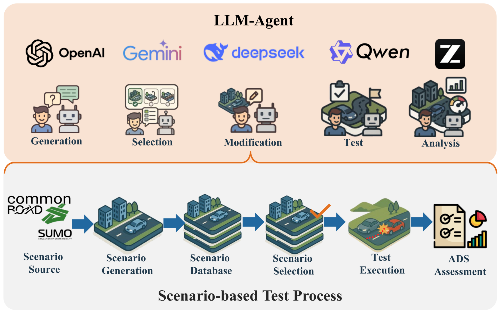
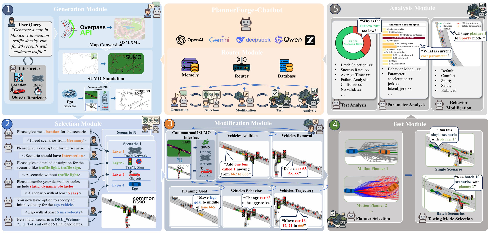
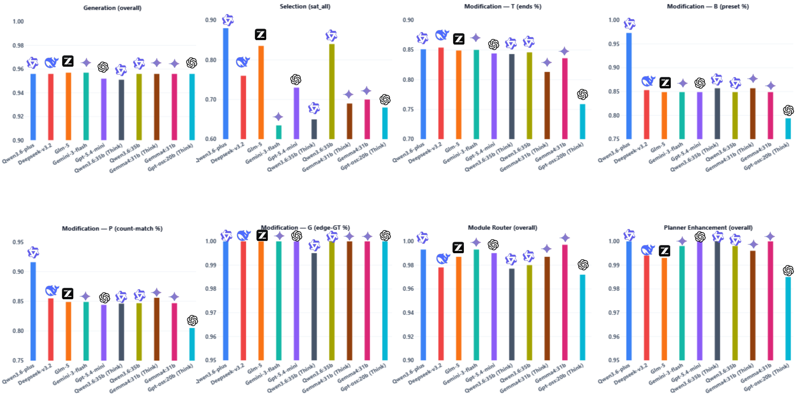
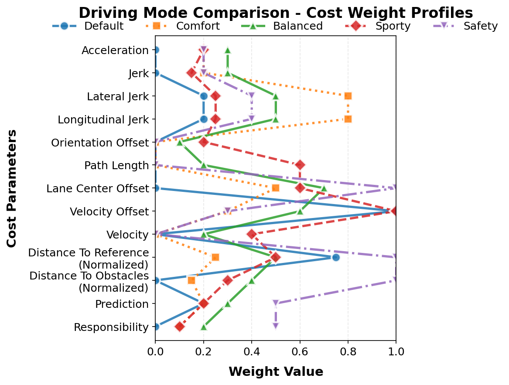
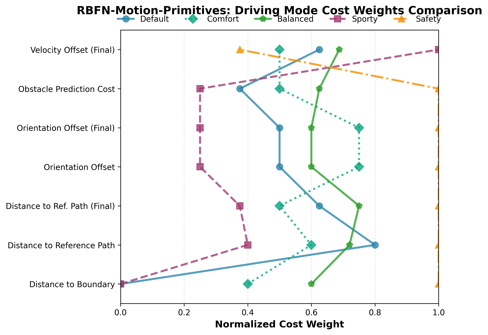

<div align="center">

# PlannerForge

**LLM Agents for Scenario-Based Testing of Motion Planners in Autonomous Driving**

**EMNLP 2026 Main Paper**

<!-- TODO before going public: project-page URL, arXiv ID -->
[](#)
[](#)
[](https://huggingface.co/datasets/Yuan-avs/PlannerForge-Scenarios)

</div>



## News

- **2026.09** — Code and dataset released.
- **2026.08** — Paper accepted to EMNLP 2026 (Main Conference).
- **2026.05** — Paper and project website released.

## Introduction

PlannerForge is a chatbot that turns free-form natural language into
executable, measurable tests for motion planners. You describe the situation
you want; it selects, modifies or generates a CommonRoad scenario, runs a
motion planner on it, retunes the planner's cost function, and explains the
result — all in one conversation, with no domain-specific fine-tuning.

Six modules cover the full scenario-based testing pipeline:

- **Router** — classifies user intent and dispatches to the right module, which
  is what makes free navigation between stages possible.
- **Generation** — synthesises new scenarios from OpenStreetMap road topology
  plus procedurally simulated SUMO traffic.
- **Selection** — dialogue-guided retrieval from a curated CommonRoad database,
  combining metadata filtering with semantic search.
- **Modification** — LLM-guided edits routed through the CommonRoad–SUMO
  interface, in four families: trajectory, behaviour, participants, goal.
- **Testing** — executes a motion planner (Frenetix or MP-RBFN) on single
  scenarios or in batch, through one planner-agnostic interface.
- **Analysis** — interprets batch results and answers questions about them.



## Performance

All numbers below are from the paper. `C/O` means commercial / open-source
backend, using `qwen3.6-plus` and `qwen3.6:35b` with the `cp_icl_cot` prompt.

### End-to-end pipeline

Each stage consumes the previous stage's actual output, starting from 200 seed
queries. **FR** is that stage's failure rate; **Cum. SR** is cumulative success
up to it. Latency and tokens are means per scenario.

| Stage | in→out (C/O) | FR ↓ | Cum. SR ↑ | Latency ↓ | Tokens ↓ |
|---|---|---|---|---|---|
| ① Generation | 200→192 / 200→192 | 4% / 4% | 96% / 96% | 21.6 s / 21.0 s | 4.5k / 4.6k |
| ② Database | 192→192 | 0% / 0% | 96% / 96% | 1.8 s / 1.8 s | 0 / 0 |
| ③ Selection | 192→181 / 192→170 | 6% / 11% | 91% / 85% | 29.3 s / 26.7 s | 8.5k / 8.5k |
| ④ Modification | 181→165 / 170→156 | 9% / 8% | 83% / 78% | 44 s / 23 s | 29k / 19k |
| ⑤ Test | 165→165 / 156→156 | 0% / 0% | 83% / 78% | 24.6 s / 23.9 s | 0 / 0 |
| ⑥ Enhancement | 165→165 / 156→156 | 0% / 0% | 83% / 78% | 4.5 s / 2.6 s | 0.5k / 0.5k |
| **End-to-end** | **200→165 / 200→156** | | **83% / 78%** | ≈**126 s** / **99 s** | ≈**42.5k** / **32.6k** |

### Per task, across ten LLM backends

Ten off-the-shelf model variants (five cloud APIs, five open-weight) under five prompt
conditions, from a bare zero-shot `baseline` to `cp_icl_cot` (context prompting
+ in-context examples + chain-of-thought). N=200 queries per cell. Best score
per task, taking the maximum over prompt conditions:

| Task | Metric | Best |
|---|---|---|
| Generation | overall | 0.957 |
| Selection | `sat_all` (all five retrieved scenarios satisfy the request) | 0.880 |
| Modification · T (trajectory) | ends % | ~100 |
| Modification · B (behaviour) | preset % | ~100 |
| Modification · P (participant) | count-match % | ~100 |
| Modification · G (goal) | edge-GT % | ~100 |
| Module Router | overall | 0.997 |
| Planner Testing & Enhancement | overall | 1.000 |

Selection is the hardest task: its strict five-stage filter fails whenever any
single extracted slot is wrong. Per-model, per-condition tables are in the
paper's appendix.



Schema-constrained tasks (Generation, Router, Planner) saturate with CP+CoT or
CP+ICL, while semantically dense tasks (Selection, Modification) need the
advanced prompting stacked. Open-weight 20–35B models run the entire pipeline,
trailing the commercial APIs only on the strict dense tasks — and on models with
native reasoning, adding an external chain-of-thought template *degrades*
performance while costing more tokens.

### Cost tuning

The planner's cost weights retuned from one natural-language request, evaluated
against the Default preset. Three independent tuning rounds per batch
(`qwen3.6-plus`, `cp_icl_cot`, temperature 0.0), paired per scenario, mean ± SD:

| N | Success ↑ (before→after) | Δ (pp) | Collision ↓ (before→after) | Δ (pp) |
|---|---|---|---|---|
| 50 | 46.7% → 68.0 ± 9.1% | +21.3 ± 6.8 | 20.7% → 7.3 ± 2.5% | −13.3 ± 5.2 |
| 100 | 51.0% → 68.6 ± 4.2% | +17.6 ± 2.6 | 20.3% → 9.8 ± 0.9% | −10.5 ± 1.7 |
| 200 | 51.3% → 71.5 ± 2.4% | +20.1 ± 0.5 | 20.6% → 8.2 ± 1.0% | −12.4 ± 1.5 |
| 300 | 51.6% → 69.8 ± 0.5% | +18.2 ± 0.7 | 18.9% → 7.8 ± 0.6% | −11.1 ± 1.3 |
| 400 | 50.4% → 70.2 ± 0.4% | +19.8 ± 0.3 | 19.0% → 8.4 ± 0.4% | −10.6 ± 0.3 |

### Cross-planner batch testing

Both bundled planners driven from a single prompt, over the same batch, through
one planner-agnostic interface — the cost weights each driving mode produces:

<p align="center">
  
  
</p>

### Comparison with prior tools

**Generation** — against Scenario Factory 2.0, the rule-based state of the art,
on 200 queries across 50 cities. PlannerForge gets the full natural-language
query; SF 2.0 gets the extracted target city, which is its native input (†).
**Exec. S** = scenarios that generate *and* execute in the planner.

| Method | Time ↓ | Exec. S ↑ | City ↑ | Road ↑ | Vehicle ↑ | Diverse ↑ | Coll ↑ |
|---|---|---|---|---|---|---|---|
| SF 2.0 | **2.2 s** | 144/200 | 72%† | ✗ | ✗ | 4 | 6.1% |
| **PlannerForge** | 21.6 s | **193/200** | **96.0%** | **92.0%** | **95.6%** | **7** | **20.0%** |

**Selection** — against BM25 keyword search on 200 natural-language queries over
the scenario database, sharing the same retrieval backend.

| Retrieval (top-5) | Latency ↓ | Tokens ↓ | Satisfy@1 ↑ | Any@5 ↑ |
|---|---|---|---|---|
| Keyword search / BM25 | **<0.01 s** | **0** | 67.5% | 86.0% |
| **PlannerForge (LLM)** | 21.6 s | 8.7k | **92.0%** | **96.5%** |

**Modification** — PlannerForge's four edit types against
From-Words-to-Collisions on the same 200 base scenarios. **Phy. Val.** = share
of edits that are physically valid; **min_risk** is mean base→modified risk,
where 0 is a collision and 5 is safe, so lower is more safety-critical.

| Method | Time ↓ | Tokens ↓ | Exec. S ↑ | Phy. Val. ↑ | New Coll. ↑ | min_risk ↓ |
|---|---|---|---|---|---|---|
| FWtC | 51 s | 17.6k | 200/200 | 31.0% | 16 | 1.84→1.69 |
| PF (Behaviour) | 56 s | 24.2k | 200/200 | 98.0% | 31 | 1.84→1.61 |
| PF (Trajectory) | 60 s | 22.1k | 194/200 | 97.9% | 32 | 1.84→1.51 |
| PF (Participant) | 63 s | 21.7k | 192/200 | 94.8% | **58** | **1.84→1.20** |
| PF (Goal) | **8 s** | **7.1k** | 199/200 | **100%** | 45 | 1.84→1.36 |

## Supported LLM backends

PlannerForge calls off-the-shelf models through LangChain — nothing is
fine-tuned. The paper evaluates eight model families, ten variants in total
(reasoning "think" and "no-think" modes count separately):

| Backend | Served via | Evaluated as |
|---|---|---|
| Qwen3.6-plus | DashScope (OpenAI-compatible) | cloud API |
| Deepseek-v3.2 | OpenAI-compatible endpoint | cloud API |
| Glm-5 | OpenAI-compatible endpoint | cloud API |
| Gemini-3-flash | Google Generative AI | cloud API |
| Gpt-5.4-mini | OpenAI-compatible endpoint | cloud API |
| Qwen3.6:35b | Ollama | open-weight (think / no-think) |
| Gemma4:31b | Ollama | open-weight (think / no-think) |
| Gpt-oss:20b | Ollama | open-weight (think) |

Pick one in `.env`:

```bash
# Google Gemini
DEFAULT_MODE=commercial
DEFAULT_API_KEY=<your key>
DEFAULT_API_MODEL=gemini-2.5-flash

# A local open-weight model through Ollama
DEFAULT_MODE=ollama
DEFAULT_OLLAMA_MODEL=qwen3:30b
DEFAULT_OLLAMA_URL=http://localhost:11434

# Any other OpenAI-compatible provider (OpenAI, DeepSeek, GLM, DashScope, ...)
QWEN_API_KEY=<your key>
QWEN_BASE_URL=<provider endpoint>
QWEN_MODEL=<model id>
```

Reproducing the paper's sweep needs commercial-API budget, or ≥24 GB VRAM for
the open-weight backends.

## Install

PlannerForge uses three isolated Python environments, because the LLM/UI stack
and the CommonRoad/SUMO stack have conflicting dependencies. The app runs in
the first and calls the others as subprocesses.

```bash
git clone --recurse-submodules <this-repo> && cd PlannerForge

python3.12 -m venv venv && source venv/bin/activate
pip install -r requirements.txt                # app: Gradio, LangChain, ChromaDB

conda env create -f environment-cr37.yml       # CommonRoad/SUMO toolchain
bash setup/apply_patches.sh                    # planner patches (submodules)
```

Full instructions, including the planner environments and the two in-package
patches: [`setup/install.md`](setup/install.md).

## Quick Start

```bash
cp .env.example .env         # add one LLM provider key
python add_scenarios.py      # download the corpus + build the ChromaDB index
python interface.py          # launch the chatbot UI
```

`add_scenarios.py` pulls the 582 scenario XMLs from the
[Hugging Face dataset](https://huggingface.co/datasets/Yuan-avs/PlannerForge-Scenarios)
into `CollectedScenarios/` on first run, then indexes them. The corpus is not
tracked in git, so the clone stays small; re-runs reuse what is already on disk.

`interface.py` opens a Gradio chat in your browser. Type what you want and the
module router works out which stage you mean:

> *"Find an urban intersection scenario in Germany with at least five vehicles."*

> *"Make the car ahead of the ego drive aggressively, then run Frenetix on it."*

The full guided tour — all six stages with example prompts, and where every
artefact lands on disk — is in [`docs/usage.md`](docs/usage.md).

## Adding your own motion planner

PlannerForge runs a planner as an **external subprocess**, so your planner keeps
its own environment and dependencies — nothing is imported into the app. The
contract is small:

1. **Register it** — one entry in `self.planners` in
   [`process_engine.py`](process_engine.py): the interpreter or venv to launch,
   the runner script, a log directory, and whether you support cost weights.
2. **Accept two commands** — `--input-file <scenario.xml>` for a single run and
   `--input-file <list.csv> --batch` for a batch (one scenario name per line).
   Exit non-zero to signal failure; stdout is streamed live into the UI.
3. **Write three things** — `<log_dir>/<scenario>/*.gif` (the animation the user
   sees), `<log_dir>/score_overview.csv` (the outcome table the analysis charts
   read), and optionally per-step cost JSONs plus a tunable cost-weight YAML,
   which is what lets the LLM retune your planner from natural language.

Full column-by-column contract, the cost-log and YAML formats, and a working
stub runner: [`docs/integrating_a_planner.md`](docs/integrating_a_planner.md).

The two bundled planners are the reference integrations — Frenetix is the full
example including cost tuning, MP-RBFN the minimal one without it.

## Documentation

| Document | Contents |
|---|---|
| [`setup/install.md`](setup/install.md) | The three environments, the CommonRoad/SUMO toolchain, planner setup, required in-package patches |
| [`docs/usage.md`](docs/usage.md) | Guided tour of all six stages with example prompts; where artefacts land on disk |
| [`docs/integrating_a_planner.md`](docs/integrating_a_planner.md) | The motion-planner subprocess contract: registration, CLI, output files, cost logs, weight YAML |
| [`THIRD_PARTY.md`](THIRD_PARTY.md) | Third-party components and their licences |

## Repository layout

```
PlannerForge/
├── interface.py                     Gradio chatbot UI (main entry point)
├── interface_generate.py            the Generate tab (bounding-box map picker)
├── process_engine.py                orchestrator: routes chat turns to the modules
├── llm_wrapper.py                   LLM providers (Gemini / Ollama / OpenAI-compatible)
├── db_wrapper.py                    ChromaDB scenario retrieval
├── prompts_lib.py                   prompt assembly for the prompt conditions
├── cr_draw_style.py                 shared scenario-drawing style (all renderers)
├── config.py                        paths and limits for the generation pipeline
├── add_scenarios.py                 builds the ChromaDB index from the corpus
├── extraction_prompt_files/         prompt templates: selection, generation, router
├── modification_prompt_files/       prompt templates: the four edit families
├── frenetix_parameter_prompt_files/ prompt templates: planner tuning and analysis
├── osm_pipeline/                    OSM → SUMO → CommonRoad scenario generation
├── commonroad_interface/            CommonRoad ⇄ SUMO conversion, simulation, rendering
├── utils/                           cost handling, XML parsing, result plots
├── CollectedScenarios/              582 scenario XMLs (downloaded, not tracked)
├── Frenetix-Motion-Planner/         motion planner (LGPL-3.0 submodule)
├── RBFN-Motion-Primitives/          motion planner (LGPL-3.0 submodule)
├── setup/                           install guide and the planner patches
└── docs/                            documentation and README figures
```

## Built on open source

PlannerForge orchestrates established open-source tools rather than
introducing new low-level algorithms. We gratefully acknowledge:

**Agent / LLM stack**
- [Gradio](https://github.com/gradio-app/gradio) — chat UI
- [LangChain](https://github.com/langchain-ai/langchain) — agent/back-end orchestration
- [ChromaDB](https://github.com/chroma-core/chroma) — vector store for scenario retrieval
- [Sentence-Transformers](https://github.com/UKPLab/sentence-transformers) · [Transformers](https://github.com/huggingface/transformers) · [PyTorch](https://github.com/pytorch/pytorch) — embeddings and model runtime
- [Ollama](https://github.com/ollama/ollama) — local open-weight model serving

**Autonomous-driving / simulation stack**
- [CommonRoad](https://commonroad.in.tum.de/) framework — [commonroad-io](https://gitlab.lrz.de/tum-cps/commonroad_io), [scenario-designer](https://gitlab.lrz.de/tum-cps/commonroad-scenario-designer), [drivability-checker](https://gitlab.lrz.de/tum-cps/commonroad-drivability-checker), [route-planner](https://gitlab.lrz.de/tum-cps/commonroad-route-planner), [vehicle-models](https://pypi.org/project/commonroad-vehicle-models/), [sumocr](https://pypi.org/project/sumocr/)
- [Eclipse SUMO](https://github.com/eclipse-sumo/sumo) — microscopic traffic simulation
- [OSMnx](https://github.com/gboeing/osmnx) + [OpenStreetMap](https://www.openstreetmap.org/) — map data for scenario generation

**Motion planners** (integrated as submodules, LGPL-3.0)
- [Frenetix-Motion-Planner](https://github.com/TUM-AVS/Frenetix-Motion-Planner)
- [RBFN-Motion-Primitives (MP-RBFN)](https://github.com/TUM-AVS/RBFN-Motion-Primitives)

**Scientific Python** — [NumPy](https://github.com/numpy/numpy), [SciPy](https://github.com/scipy/scipy), [pandas](https://github.com/pandas-dev/pandas), [Shapely](https://github.com/shapely/shapely), [Matplotlib](https://github.com/matplotlib/matplotlib), [lxml](https://github.com/lxml/lxml), [Pillow](https://github.com/python-pillow/Pillow), [imageio](https://github.com/imageio/imageio), [OmegaConf](https://github.com/omry/omegaconf), [requests](https://github.com/psf/requests), [python-dotenv](https://github.com/theskumar/python-dotenv), [PyYAML](https://github.com/yaml/pyyaml).

**LLM backends evaluated** — open-weight, served locally via Ollama: [Qwen](https://github.com/QwenLM/Qwen3), [Gemma](https://ai.google.dev/gemma), [gpt-oss](https://github.com/openai/gpt-oss). Commercial APIs accessed through LangChain: Qwen-Plus/DashScope, [DeepSeek](https://github.com/deepseek-ai/DeepSeek-V3), GLM, Google Gemini, OpenAI. See the paper's Appendix A.1 for exact pinned model identifiers.

Version pins for the full stack are in [`requirements.txt`](requirements.txt)
and [`environment-cr37.yml`](environment-cr37.yml).

## Citation

```bibtex
@inproceedings{gao2026plannerforge,
  title     = {PlannerForge: LLM Agents for Scenario-Based Testing of Motion
               Planners in Autonomous Driving},
  author    = {Gao, Yuan and M\"uller, Sebastian and Piccinini, Mattia and
               Kaufeld, Marc and Song, Qunying and Betz, Johannes},
  booktitle = {Proceedings of the 2026 Conference on Empirical Methods in
               Natural Language Processing (EMNLP 2026)},
  publisher = {Association for Computational Linguistics},
  year      = {2026}
}
```

The ACL Anthology entry, with pages and DOI, will replace this once published.
Machine-readable metadata: [`CITATION.cff`](CITATION.cff).

## License

PlannerForge's own code is MIT ([`LICENSE`](LICENSE)). The two bundled motion
planners are LGPL-3.0 and ship as git submodules pinned to their upstream
repositories plus patch files, not as forks — see
[`THIRD_PARTY.md`](THIRD_PARTY.md).

Figures and result tables in this README are taken from the published paper.
Regenerate the figures with
[`docs/assets/regenerate.sh`](docs/assets/regenerate.sh); the paper revision
they came from is recorded in `docs/assets/SOURCE.txt`.
